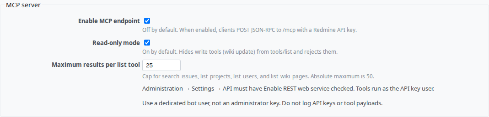
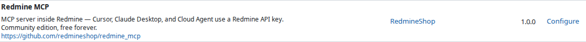
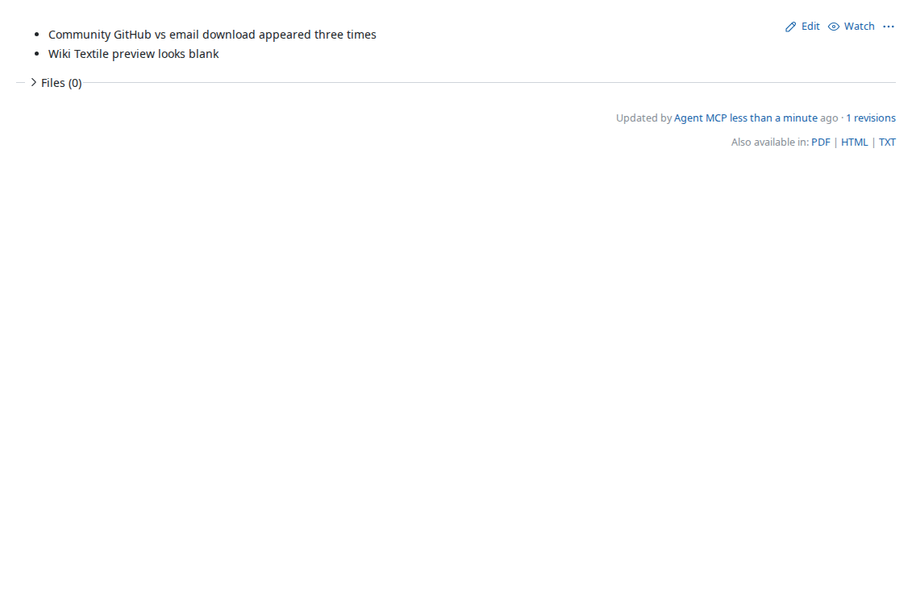

# Redmine MCP

[](https://redmineshop.com/products/redmine-mcp)
[](LICENSE)
[](https://github.com/redmineshop/redmine_mcp/actions/workflows/ci.yml)

**Last maintained:** 2026-09-21

**Source on GitHub:** [github.com/redmineshop/redmine_mcp](https://github.com/redmineshop/redmine_mcp)

An MCP server that runs **inside Redmine**. Cursor Desktop, Cursor Cloud Agent, and Claude Desktop call `POST /mcp` with a Redmine API key. Tools run as that user and honor `allowed_to?` / `.visible`.

Community edition is **free forever** — no license key, no phone-home, **no email to clone**.

The public repo may still be empty until the maintainer publishes this folder with `publish-community-plugins.sh`. Until then, clone from the RedmineShop monorepo path `demo/plugins/redmine_mcp`.

## Features

- One HTTP endpoint: `POST /mcp` (JSON-RPC 2.0). **Off until an admin enables it.**
- Auth: `X-Redmine-API-Key` (also `Authorization: Bearer` or `?key=`)
- **Read-only on by default.** Write tools are omitted from `tools/list` and rejected if called.
- Issue tools are **read only**: `search_issues`, `get_issue` (structure + description + visible notes)
- Wiki: `list_wiki_pages`, `get_wiki_page`, and `update_wiki_page` (only when read-only is off)
- Also: `whoami`, `list_projects`, `get_project`, `list_enumerations`, `list_custom_fields`, `list_users`
- Result cap (default 25, hard max 50)
- English + Vietnamese settings strings

This is not a hosted LLM and not the planned AI Assistant suite. It does not create or update issues. It does not edit storefront catalog or Markdown.

## Compatibility

| Redmine | Ruby | Database | Status |
|---------|------|----------|--------|
| 6.x     | 3.2+ | MySQL 8 / PostgreSQL | Targeted — **untested** (no published QA matrix) |
| 5.1.x   | 3.1+ | MySQL 8 / PostgreSQL | Targeted — **untested** |

The plugin declares `requires_redmine version_or_higher: '5.1'`. Do not treat catalog versions as tested cells. The demo quality harness is **one** Redmine image, not a 5.1 / 6.x matrix. OAuth2 is not included (Redmine 6.1+ only).

## Installation

**Estimated time: 15 minutes.**

### 1. Clone from GitHub

```bash
cd /path/to/redmine/plugins
git clone https://github.com/redmineshop/redmine_mcp.git
ls redmine_mcp/init.rb
```

Do not rename the plugin directory. If you download a GitHub ZIP, rename the unpacked `redmine_mcp-main` folder to `redmine_mcp`.

If the public repository is not published yet:

```bash
# From the RedmineShop monorepo
cp -R demo/plugins/redmine_mcp /path/to/redmine/plugins/redmine_mcp
```

### 2. Restart Redmine

No extra gems and no migration.

```bash
# systemd / Puma / docker compose restart — pick what you already use
docker restart YOUR_REDMINE_CONTAINER
```

Confirm **Administration → Plugins** lists **Redmine MCP** 1.0.0.

### 3. Enable REST API

**Administration → Settings → API** → check **Enable REST web service**. MCP authenticates with a Redmine API key.

### 4. Create a bot user and copy its API key

Create a non-admin user (example login `agent-mcp`). Add it as a **Reporter** (or a custom read role) on the projects the agent should see. Open **My account** while signed in as that user and copy the API key.

Do not paste an administrator key into an AI client.

### 5. Enable the endpoint

**Administration → Plugins → Redmine MCP → Configure**

1. Check **Enable MCP endpoint**
2. Leave **Read-only mode** checked unless you want wiki updates
3. Save

### 6. Connect a client

Endpoint: `https://YOUR-REDMINE/mcp`

Header: `X-Redmine-API-Key: <bot-user-api-key>`

## Cursor Desktop recipe

Add an HTTP MCP server in Cursor Settings → MCP. Example `mcp.json` entry:

```json
{
  "mcpServers": {
    "redmine": {
      "url": "https://YOUR-REDMINE/mcp",
      "headers": {
        "X-Redmine-API-Key": "<bot-user-api-key>"
      }
    }
  }
}
```

Then ask: “Call `whoami`, then `list_projects`. Summarize Support issues from the last week. Do not include email addresses.”

First `tools/list` should succeed within a few minutes of enabling the plugin. If it 401s, the API key is wrong or REST API is off. If it 403s, the endpoint is still disabled.

## Cursor Cloud Agent recipe

Give the Cloud Agent an HTTP MCP server with the same URL and header. Store the API key in the agent environment — **do not commit it**.

```bash
curl -sS -X POST "$REDMINE_URL/mcp" \
  -H "Content-Type: application/json" \
  -H "X-Redmine-API-Key: $REDMINE_MCP_API_KEY" \
  -d '{"jsonrpc":"2.0","id":1,"method":"initialize","params":{"protocolVersion":"2025-03-26","capabilities":{},"clientInfo":{"name":"cloud-agent","version":"1"}}}'
```

Then `tools/list` and `tools/call` with `search_issues` / `get_issue` / `list_wiki_pages`.

On a public internet Redmine, keep **Read-only mode** on.

## Claude Desktop recipe

Use an HTTP MCP transport that can send a custom header (or a small local proxy that injects `X-Redmine-API-Key`). The server is stateless POST — no SSE in v1.

## Screenshots

Plugin settings (demo Redmine, plugin quality harness):



Administration → Plugins:



Wiki page written with `update_wiki_page` after read-only was turned off (local/demo only):



Screenshot refresh lives in the private `redmineshop/redmineshop` harness. A public clone cannot run it.

## Uninstall

Remove `plugins/redmine_mcp` and restart Redmine. There is no database table to roll back. Plugin settings remain in Redmine’s `settings` table until you delete that row.

## Tests

Unit + functional (beyond `ruby -c`):

```bash
bundle exec rake redmine:plugins:test NAME=redmine_mcp RAILS_ENV=test
```

On the private `redmineshop/redmineshop` demo stack (not this public clone):

```bash
PLUGIN_NAME=redmine_mcp ./demo/scripts/run-sso-plugin-tests.sh
```

### Quality harness (demo + E2E)

E2E lives in the **private** `redmineshop/redmineshop` harness (`docker-compose.demo.yml` + Playwright). This public GitHub repo is the plugin only — it does not ship that compose file, and a public clone cannot open private harness docs.

Install and smoke this plugin on your own Redmine: [Redmine MCP product page](https://redmineshop.com/products/redmine-mcp).

| Bar | Status |
| --- | --- |
| Automated tests beyond `ruby -c` | **Verified** — `test/unit` + `test/functional` in this repo |
| Installed + enabled on demo Redmine | **Verified** — mounted via `demo/plugins/` on the private monorepo demo stack; seed enables `/mcp` on `plugin-qa` |
| E2E primary happy path | **Verified** — Playwright on that private harness (`tools/list`, issue read, wiki read/update) |
| UI screenshot in README | **Verified** — `screenshots/*.png` from that spec |
| Redmine 5.1 / 6.x matrix | **Declared / untested** — this harness is one demo image, not a QA matrix |

## Community support

Async only: [GitHub issues](https://github.com/redmineshop/redmine_mcp/issues) or the [support form](https://redmineshop.com/support). No 24/7 SLA.

## License

MIT — see `LICENSE`.
